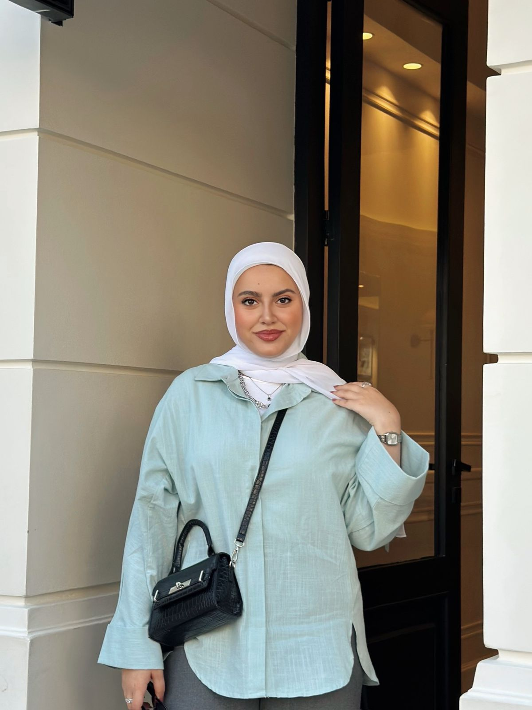
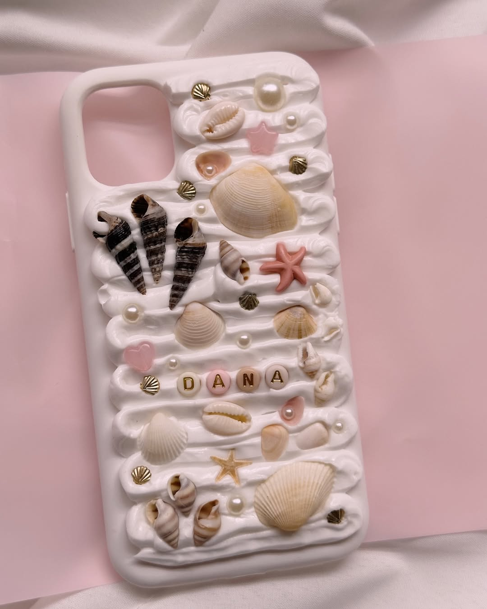

# Nala Shop Customization Guide

This guide shows you exactly where to edit colors, fonts, and styling for different sections of your Nala Shop website.

## 📋 Quick Navigation

| Section | Description | Jump Link |
|---------|-------------|----------|
| 🎨 **Header Section** | Customize navigation bar, logo, mobile menu | [Go to Header](#-header-section-customization) |
| 🛒 **Cart Section** | Style cart sidebar, buttons, checkout modal | [Go to Cart](#-cart-section-customization) |
| 🌊 **Hero Section** | Edit slideshow, overlay, text, buttons | [Go to Hero](#-hero-section-customization) |
| 🖼️ **Lightbox Modal** | Customize image viewer colors and styling | [Go to Lightbox](#-lightbox-modal-customization) |
| 🏆 **Featured Collections** | Style collection cards, shadows, gradients | [Go to Collections](#-featured-collections-section-customization) |
| 🛍️ **Products Section** | Add/remove products, customize grid layout | [Go to Products](#-products-section-customization) |
| 📖 **About Section** | Customize story, creator section, feature cards | [Go to About](#-about-section-customization) |
| 📱 **Follow Our Journey** | Instagram feed, posts, reels, social media integration | [Go to Follow Our Journey](#-follow-our-journey-section-customization) |
| 🦶 **Footer Section** | Contact info, social links, copyright, branding | [Go to Footer](#-footer-section-customization) |
| 🎨 **Color Variables** | Available color variables and themes | [Go to Colors](#-available-color-variables) |
| 📝 **Quick Tips** | General customization tips and best practices | [Go to Tips](#-quick-tips) |

---

## 🎨 Header Section Customization

### Background Color
**Location:** `index.html` - Line 31
```html
<header class="fixed top-0 left-0 right-0 z-50 transition-all duration-300" style="background-color: #FFBEDD;">
```
**How to change:**
- Replace `#FFBEDD` with any hex color (e.g., `#4A90E2` for blue)
- Or remove inline style and add CSS class in `css/styles.css`

### Alternative: CSS Class Method
1. Remove the inline style from line 31
2. Add this to `css/styles.css`:
```css
header {
    background-color: #your-color-here;
}
```

---

## 🛒 Cart Section Customization

### Cart Sidebar Background
**Location:** `index.html` - Line 804
```html
<div id="cartSidebar" class="fixed top-0 right-0 h-full w-80 bg-white shadow-lg transform translate-x-full transition-transform duration-300 z-50 overflow-y-auto">
```
**Change:** Replace `bg-white` with `bg-gray-100`, `bg-pink-50`, etc.

### Cart Total Color
**Location:** `index.html` - Line 819
```html
<span id="cartTotal" class="text-pink-500 font-bold">$0.00</span>
```
**Change:** Replace `text-pink-500` with `text-blue-600`, `text-purple-600`, etc.

### Modal Backdrop
**Location:** `css/styles.css` - Line 565
```css
.modal-backdrop {
    background: rgba(0, 0, 0, 0.5);
}
```
**Change:** Modify rgba values for different overlay colors

### Empty Cart Modal
**Location:** `css/styles.css` - Lines 1727-1733
```css
.empty-cart-modal {
    background: linear-gradient(135deg, #667eea 0%, #764ba2 100%);
}
```
**Change:** Replace gradient colors

### Checkout Button
**Location:** Uses `.btn-ocean` class - modify in `css/styles.css` lines 631-680

---

## 🌊 Hero Section Customization

### Background Overlay
**Location:** `index.html` - Line 100
```html
<div class="absolute inset-0 bg-black bg-opacity-50"></div>
```
**Change:** 
- `bg-black` to `bg-blue-900`, `bg-purple-800`, etc.
- `bg-opacity-50` to `bg-opacity-30`, `bg-opacity-70`, etc.

### Loading Spinner Background
**Location:** `index.html` - Line 90
```html
<div class="slideshow-loading absolute inset-0 bg-gradient-to-br from-pink-100 to-blue-100 flex items-center justify-center">
```
**Change:** Replace `from-pink-100 to-blue-100` with different gradient colors

### Spinner Color
**Location:** `index.html` - Line 91
```html
<div class="animate-spin rounded-full h-12 w-12 border-b-2 border-pink-500"></div>
```
**Change:** Replace `border-pink-500` with `border-blue-500`, etc.

### Main Title Font
**Location:** `index.html` - Line 104
```html
<h1 class="text-6xl md:text-8xl text-white mb-6 drop-shadow-lg" style="font-family: 'Dancing Script', cursive; font-weight: 700;">Ocean Dreams</h1>
```
**Change:** Replace `'Dancing Script', cursive` with:
- `'Playfair Display', serif`
- `'Montserrat', sans-serif`
- `'Poppins', sans-serif`

### Description Text Font
**Location:** `index.html` - Lines 105-108
```html
<p class="text-lg md:text-xl text-white mb-8 max-w-3xl mx-auto drop-shadow-md" style="font-family: 'Montserrat', sans-serif; font-weight: 300; letter-spacing: 0.5px;">
```
**Change:** Modify font-family, font-weight, and letter-spacing

### Button Colors
**Location:** `css/styles.css` - Lines 631-680
```css
.btn-ocean {
    background: var(--gradient-ocean);  /* Main color */
}

.btn-ocean::before {
    background: var(--gradient-sunset); /* Hover color */
}
```

### Available Gradients
**Location:** `css/styles.css` - Lines 50-54
```css
--gradient-ocean: linear-gradient(135deg, var(--coral-pink) 0%, var(--ocean-teal) 50%, var(--shell-white) 100%);
--gradient-sunset: linear-gradient(135deg, #ff9a9e 0%, #fecfef 50%, #fecfef 100%);
--gradient-pearl: linear-gradient(135deg, #f093fb 0%, #f5576c 100%);
--gradient-shell: linear-gradient(135deg, #4facfe 0%, #00f2fe 100%);
--gradient-coral: linear-gradient(135deg, #fa709a 0%, #fee140 100%);
```

### Text Colors
**Current:** All text uses `text-white` class
**Change to:** `text-gray-100`, `text-pink-100`, or add custom color in style attribute

---

## 🖼️ Lightbox Modal Customization

### Background Overlay
**Location:** `index.html` - Line 124
```html
<div id="lightbox" class="fixed inset-0 bg-black bg-opacity-90 z-50 hidden flex items-center justify-center p-4">
```
**Change:**
- `bg-black` to `bg-blue-900`, `bg-gray-900`, `bg-purple-900`
- `bg-opacity-90` to `bg-opacity-80`, `bg-opacity-95`

### Close Button (×)
**Location:** `index.html` - Line 126
```html
<button onclick="closeLightbox()" class="absolute top-4 right-4 text-white text-3xl hover:text-pink-300 z-10">&times;</button>
```
**Change:**
- `text-white` to `text-gray-200`, `text-blue-100`
- `hover:text-pink-300` to `hover:text-blue-400`, `hover:text-purple-400`

### Navigation Buttons (< >)
**Location:** `index.html` - Lines 127-128
```html
<button onclick="prevLightboxImage()" class="absolute left-4 top-1/2 transform -translate-y-1/2 text-white text-3xl hover:text-pink-300 z-10">&lt;</button>
<button onclick="nextLightboxImage()" class="absolute right-4 top-1/2 transform -translate-y-1/2 text-white text-3xl hover:text-pink-300 z-10">&gt;</button>
```
**Change:** Same as close button colors

### Image Border
**Location:** `index.html` - Line 129
```html

```
**Change:**
- `rounded-lg` to `rounded-xl`, `rounded-2xl`, `rounded-none`
- Add border: `border-4 border-white`, `border-2 border-pink-300`

### Caption Text
**Location:** `index.html` - Lines 131-132
```html
<div class="absolute bottom-4 left-1/2 transform -translate-x-1/2 text-white text-center">
    <p id="lightbox-caption" class="text-lg mb-2"></p>
    <p id="lightbox-counter" class="text-sm opacity-75"></p>
</div>
```
**Change:**
- `text-white` to `text-gray-200`, `text-pink-100`
- `opacity-75` to `opacity-50`, `opacity-90`

### Advanced Lightbox Effects

#### Add Background Blur:
```html
class="fixed inset-0 bg-black bg-opacity-80 backdrop-blur-sm z-50 hidden flex items-center justify-center p-4"
```

#### Add Gradient Background:
```html
class="fixed inset-0 bg-gradient-to-br from-purple-900 to-blue-900 bg-opacity-90 z-50 hidden flex items-center justify-center p-4"
```

#### Style the Container:
```html
<div class="relative max-w-4xl max-h-full bg-white bg-opacity-10 rounded-xl p-4 backdrop-blur-sm">
```

---

## 📖 About Section Customization

### Section Title & Background
**Location:** `index.html` - Lines 179-182
```html
<section id="about" class="py-20">
    <div class="max-w-7xl mx-auto px-4">
        <div class="text-center mb-16">
            <h2 class="text-4xl font-playfair font-bold text-gradient mb-8">Our Ocean Story</h2>
```
**Change:**
- `py-20` to adjust section padding
- `text-gradient` to `text-gradient-sunset`, `text-gradient-pearl`, `text-gradient-shell`
- `text-4xl` to adjust title size
- `"Our Ocean Story"` to your custom title
- Add background: `bg-gray-50`, `bg-gradient-to-b from-pink-50 to-blue-50`

### Story Text Content
**Location:** `index.html` - Lines 185-194
```html
<p class="text-lg text-gray-600 mb-8 leading-relaxed">
    Since 2019, Nala Shop has been creating unique phone cases...
</p>
<p class="text-lg text-gray-600 mb-8 leading-relaxed">
    Our "Small Details, Big Vibes" philosophy ensures...
</p>
```
**Change:**
- `text-gray-600` to `text-blue-600`, `text-purple-600` (text color)
- `text-lg` to adjust text size
- Replace the story text with your own content
- `leading-relaxed` to adjust line spacing

### Feature Cards (3 Cards)
**Location:** `index.html` - Lines 197-211
```html
<div class="grid grid-cols-1 md:grid-cols-3 gap-8">
    <div class="text-center">
        <div class="w-20 h-20 mx-auto mb-6 rounded-full ocean-gradient flex items-center justify-center text-3xl">🌊</div>
        <h3 class="text-xl font-playfair font-bold mb-4">Handcrafted Quality</h3>
        <p class="text-gray-600">Each case is individually created with care and attention to detail</p>
    </div>
```
**Change:**
- `ocean-gradient` to `gradient-sunset`, `gradient-pearl`, `gradient-shell`, `gradient-coral`
- `text-3xl` to adjust emoji/icon size
- `🌊` to different emojis (🎨, 💎, 🌟, etc.)
- `text-xl` to adjust card title size
- `text-gray-600` to change description color
- Replace titles and descriptions with your content
- `gap-8` to adjust spacing between cards

### Creator Section Background
**Location:** `index.html` - Line 215
```html
<div class="mt-20 creator-section shell-pattern rounded-3xl p-8 md:p-12 relative overflow-hidden">
```
**Change:**
- `mt-20` to adjust top margin
- `shell-pattern` to `bg-gray-100`, `bg-gradient-to-r from-pink-100 to-blue-100`
- `rounded-3xl` to adjust corner radius
- `p-8 md:p-12` to adjust padding

### Creator Section Styling
**Location:** `css/styles.css` - Lines 1226-1238
```css
.creator-section {
    background: linear-gradient(135deg, 
        rgba(239, 223, 213, 0.9) 0%, 
        rgba(246, 179, 187, 0.2) 25%, 
        rgba(245, 153, 169, 0.2) 50%, 
        rgba(244, 140, 129, 0.2) 75%, 
        rgba(248, 193, 140, 0.9) 100%);
    backdrop-filter: blur(10px);
    border: 1px solid rgba(246, 179, 187, 0.3);
}
```
**Change:**
- Replace gradient colors with your preferred colors
- `blur(10px)` to adjust background blur
- Border color `rgba(246, 179, 187, 0.3)`

### Floating Decorative Elements
**Location:** `index.html` - Lines 217-219
```html
<div class="absolute top-10 left-10 text-4xl opacity-20 floating" style="animation-delay: 0s;">🌸</div>
<div class="absolute top-20 right-20 text-3xl opacity-20 floating" style="animation-delay: 1s;">✨</div>
<div class="absolute bottom-20 left-20 text-3xl opacity-20 floating" style="animation-delay: 2s;">🌊</div>
```
**Change:**
- `🌸`, `✨`, `🌊` to different emojis
- `text-4xl`, `text-3xl` to adjust sizes
- `opacity-20` to adjust transparency
- `top-10`, `right-20`, etc. to adjust positions
- `animation-delay` values to change timing

### Floating Animation
**Location:** `css/styles.css` - Lines 590-592
```css
.floating {
    animation: float 3s ease-in-out infinite;
}
```
**Change:**
- `3s` to adjust animation speed
- `ease-in-out` to change animation timing

### Creator Photo
**Location:** `index.html` - Line 227
```html

```
**Change:**
- `src="images/Dana.jpeg"` to your photo path
- `alt` text to your description
- `w-80 h-80` to adjust photo size
- `border-4 border-white` to change border
- `rounded-full` to `rounded-3xl` for different shape

### Creator Photo Styling
**Location:** `css/styles.css` - Lines 1258-1275
```css
.creator-photo-container {
    transition: all 0.3s ease;
}

.creator-photo-container:hover {
    transform: scale(1.05);
}

.creator-photo {
    transition: all 0.3s ease;
    filter: brightness(1.1) contrast(1.1);
}
```
**Change:**
- `scale(1.05)` to adjust hover scale
- `brightness(1.1)` and `contrast(1.1)` for photo effects
- `0.3s` to adjust transition speed

### Creator Story Title
**Location:** `index.html` - Line 238
```html
<h3 class="text-4xl font-playfair font-bold text-gradient mb-8 creator-title">قصة المؤسسة</h3>
```
**Change:**
- `text-4xl` to adjust title size
- `text-gradient` to different gradient classes
- `"قصة المؤسسة"` to your title (Arabic or English)
- `font-playfair` to different fonts

### Story Paragraphs
**Location:** `index.html` - Lines 241-249
```html
<p class="story-paragraph bg-white/50 backdrop-blur-sm rounded-2xl p-6 shadow-lg border border-pink-200/50">
    أنا دانه فراس، بلشت مشواري سنة 2019...
</p>
```
**Change:**
- `bg-white/50` to adjust background transparency
- `backdrop-blur-sm` to change blur amount
- `rounded-2xl` to adjust corner radius
- `p-6` to adjust padding
- `border-pink-200/50` to change border color
- Replace Arabic text with your story
- `dir="rtl"` for Arabic text direction

### Story Paragraph Styling
**Location:** `css/styles.css` - Lines 1289-1302
```css
.story-paragraph {
    transition: all 0.3s ease;
    animation: fadeInUp 1s ease-out;
}

.story-paragraph:hover {
    transform: translateY(-2px);
    box-shadow: 0 10px 25px rgba(255, 181, 186, 0.3);
    background: rgba(255, 255, 255, 0.8);
}
```
**Change:**
- `translateY(-2px)` to adjust hover lift
- `rgba(255, 181, 186, 0.3)` for hover shadow color
- `rgba(255, 255, 255, 0.8)` for hover background
- Animation delays for staggered appearance

### Sparkle Badge (Decorative Element)
**Location:** `index.html` - Lines 228-230
```html
<div class="absolute -bottom-4 -right-4 w-20 h-20 bg-gradient-to-r from-pink-400 to-purple-500 rounded-full flex items-center justify-center text-white text-2xl shadow-lg sparkle-badge z-20">
    ✨
</div>
```
**Change:**
- `from-pink-400 to-purple-500` to different gradient colors
- `w-20 h-20` to adjust badge size
- `text-2xl` to adjust emoji size
- `✨` to different emoji
- `-bottom-4 -right-4` to adjust position

### Grid Layout
**Location:** `index.html` - Line 197
```html
<div class="grid grid-cols-1 md:grid-cols-3 gap-8">
```
**Change:**
- `md:grid-cols-3` to `md:grid-cols-2` or `md:grid-cols-4`
- `gap-8` to adjust spacing between feature cards

### Section Text Direction
**For Arabic content:**
- Add `dir="rtl"` to containers
- Use `text-right` instead of `text-left`
- Use `lg:text-right` instead of `lg:text-left`

---

## 📱 Follow Our Journey Section Customization

### Section Background & Header
**Location:** `index.html` - Lines 284-295
```html
<section class="py-16 bg-gradient-to-br from-pink-50 to-purple-50">
    <div class="container mx-auto px-6">
        <div class="text-center mb-12">
            <div class="inline-flex items-center justify-center w-16 h-16 bg-gradient-to-r from-pink-500 to-purple-600 rounded-full mb-6">
                <i class="fab fa-instagram text-white text-2xl"></i>
            </div>
            <h2 class="text-4xl font-playfair font-bold text-gray-800 mb-4">Follow Our Journey</h2>
            <p class="text-xl text-gray-600 mb-6">See our latest handmade creations on Instagram</p>
```
**Change:**
- `py-16` to adjust section padding
- `bg-gradient-to-br from-pink-50 to-purple-50` to different background gradients
- `w-16 h-16` to adjust icon container size
- `from-pink-500 to-purple-600` to change icon background gradient
- `text-4xl` to adjust title size
- `"Follow Our Journey"` to your custom title
- `text-xl` to adjust subtitle size
- Replace subtitle text with your content

### Follow Button
**Location:** `index.html` - Lines 292-296
```html
<a href="https://www.instagram.com/nala_shoopp/" target="_blank" class="inline-flex items-center px-6 py-3 bg-gradient-to-r from-pink-500 to-purple-600 text-white rounded-full font-semibold hover:from-pink-600 hover:to-purple-700 transition-all duration-300">
    <i class="fab fa-instagram mr-2"></i>
    Follow @nala_shoopp
</a>
```
**Change:**
- `href` to your Instagram URL
- `px-6 py-3` to adjust button padding
- `from-pink-500 to-purple-600` to change button gradient
- `hover:from-pink-600 hover:to-purple-700` for hover colors
- `"Follow @nala_shoopp"` to your Instagram handle
- `rounded-full` to `rounded-lg` for different button shape

### Instagram Posts Grid
**Location:** `index.html` - Line 299
```html
<div class="grid grid-cols-1 md:grid-cols-2 lg:grid-cols-4 gap-6 mb-12">
```
**Change:**
- `lg:grid-cols-4` to `lg:grid-cols-3` or `lg:grid-cols-2` for different layouts
- `gap-6` to adjust spacing between posts
- `mb-12` to adjust bottom margin

### Individual Instagram Post
**Location:** `index.html` - Lines 301-330 (Example Post)
```html
<a href="https://www.instagram.com/p/DGBMfhGt9YH/?img_index=1" target="_blank" class="block">
    <div class="bg-white rounded-2xl overflow-hidden shadow-lg hover:shadow-xl transition-all duration-300 transform hover:scale-105 instagram-post cursor-pointer">
        <div class="relative">
            
            <div class="absolute top-3 left-3 bg-black bg-opacity-50 text-white px-2 py-1 rounded-full text-xs">
                <i class="fab fa-instagram mr-1"></i>@nala_shoopp
            </div>
        </div>
```
**Change:**
- `href` to your Instagram post URL
- `src="images/36.jpeg"` to your image path
- `alt` text to describe your image
- `h-64` to adjust image height
- `@nala_shoopp` to your Instagram handle
- `rounded-2xl` to adjust card corner radius

### Post Engagement Stats
**Location:** `index.html` - Lines 320-330 (Inside post)
```html
<div class="flex items-center space-x-4">
    <div class="flex items-center space-x-1">
        <i class="fas fa-heart text-red-500"></i>
        <span class="text-gray-600">245</span>
    </div>
    <div class="flex items-center space-x-1">
        <i class="fas fa-comment text-gray-500"></i>
        <span class="text-gray-600">18</span>
    </div>
</div>
<span class="text-xs text-blue-600">#handmade #jordan #softwhispers</span>
```
**Change:**
- `245`, `18` to your actual engagement numbers
- `#handmade #jordan #softwhispers` to your hashtags
- `text-red-500`, `text-gray-500` to change icon colors
- `text-blue-600` to change hashtag color

### Instagram Post Styling
**Location:** `css/styles.css` - Lines 1471-1500
```css
.instagram-post {
    background: white;
    border-radius: 16px;
    overflow: hidden;
    box-shadow: 0 4px 20px rgba(0, 0, 0, 0.1);
    transition: all 0.3s ease;
    cursor: pointer;
    border: 1px solid #e1e8ed;
}

.instagram-post:hover {
    transform: translateY(-5px);
    box-shadow: 0 20px 40px rgba(0,0,0,0.15);
}
```
**Change:**
- `border-radius: 16px` to adjust corner radius
- `box-shadow` values to change shadow intensity
- `translateY(-5px)` to adjust hover lift effect
- `border: 1px solid #e1e8ed` to change border color
- `transition: all 0.3s ease` to adjust animation speed

### Instagram Reels Section
**Location:** `index.html` - Lines 442-448
```html
<div class="mt-16 mb-12">
    <div class="text-center mb-8">
        <h3 class="text-3xl font-playfair font-bold mb-4 text-gray-800">Instagram Reels</h3>
        <p class="text-xl text-gray-600 mb-6">Watch our products come to life!</p>
    </div>
```
**Change:**
- `mt-16 mb-12` to adjust section spacing
- `text-3xl` to adjust reels title size
- `"Instagram Reels"` to your custom title
- `text-xl` to adjust subtitle size
- Replace subtitle text with your content

### Reels Grid Layout
**Location:** `index.html` - Line 451
```html
<div class="grid grid-cols-1 md:grid-cols-2 lg:grid-cols-3 gap-6">
```
**Change:**
- `lg:grid-cols-3` to `lg:grid-cols-2` or `lg:grid-cols-4`
- `gap-6` to adjust spacing between reels

### Individual Reel Card
**Location:** `index.html` - Lines 453-460
```html
<div class="bg-white rounded-2xl overflow-hidden shadow-lg hover:shadow-xl transition-all duration-300 transform hover:scale-105 instagram-reel">
    <div class="relative aspect-[9/16] bg-gradient-to-br from-pink-100 to-purple-100">
        <video class="plyr-video w-full h-full object-cover" poster="images/1.jpeg" preload="metadata" playsinline>
            <source src="images/7.mp4" type="video/mp4">
        </video>
```
**Change:**
- `rounded-2xl` to adjust card corner radius
- `aspect-[9/16]` to change video aspect ratio
- `from-pink-100 to-purple-100` to change background gradient
- `poster="images/1.jpeg"` to your video thumbnail
- `src="images/7.mp4"` to your video file
- `hover:scale-105` to adjust hover scale effect

### Reel Video Styling
**Location:** `css/styles.css` - Lines 1685-1715
```css
.instagram-reel {
    position: relative;
}

.instagram-reel .plyr--video,
.instagram-reel .plyr__video-wrapper {
    border-radius: 16px;
    overflow: hidden;
    height: 100%;
}

.instagram-reel .plyr__controls {
    opacity: 0;
    transition: opacity .2s ease-in-out;
}

.instagram-reel:hover .plyr__controls {
    opacity: 1;
}
```
**Change:**
- `border-radius: 16px` to adjust video corner radius
- `opacity: 0` to `opacity: 0.3` for always visible controls
- `transition: opacity .2s` to adjust fade speed

### Reel Engagement Stats
**Location:** `index.html` - Lines 480-490 (Inside reel)
```html
<div class="flex items-center space-x-1">
    <i class="fas fa-heart text-red-500"></i>
    <span class="text-gray-600">1.2K</span>
</div>
<div class="flex items-center space-x-1">
    <i class="fas fa-comment text-gray-500"></i>
    <span class="text-gray-600">89</span>
</div>
<div class="flex items-center space-x-1">
    <i class="fas fa-share text-gray-500"></i>
    <span class="text-gray-600">45</span>
</div>
```
**Change:**
- `1.2K`, `89`, `45` to your actual engagement numbers
- `text-red-500`, `text-gray-500` to change icon colors
- Add more engagement types (saves, etc.)

### View More Reels Button
**Location:** `index.html` - Lines 590-594
```html
<a href="https://www.instagram.com/nala_shoopp/reels/" target="_blank" class="inline-flex items-center px-8 py-3 bg-gradient-to-r from-purple-500 to-pink-600 text-white rounded-full font-semibold hover:from-purple-600 hover:to-pink-700 transition-all duration-300 transform hover:scale-105">
    <i class="fab fa-instagram mr-2"></i>
    View More Reels
</a>
```
**Change:**
- `href` to your Instagram reels URL
- `px-8 py-3` to adjust button padding
- `from-purple-500 to-pink-600` to change gradient
- `"View More Reels"` to your custom text
- `hover:scale-105` to adjust hover effect

### User Generated Content Section
**Location:** `index.html` - Lines 598-608
```html
<div class="mt-12 text-center">
    <h3 class="text-2xl font-playfair font-bold mb-6 text-gray-800">Share Your Nala Moments</h3>
    <p class="text-gray-600 mb-6">Tag us @nala_shoopp to be featured!</p>
    <div class="flex flex-wrap justify-center gap-2 mb-8">
        <span class="px-3 py-1 bg-pink-100 text-pink-600 rounded-full text-sm">#nalashop</span>
        <span class="px-3 py-1 bg-purple-100 text-purple-600 rounded-full text-sm">#handmade</span>
        <span class="px-3 py-1 bg-blue-100 text-blue-600 rounded-full text-sm">#jordan</span>
        <span class="px-3 py-1 bg-green-100 text-green-600 rounded-full text-sm">#madewithlove</span>
    </div>
```
**Change:**
- `"Share Your Nala Moments"` to your custom title
- `"Tag us @nala_shoopp to be featured!"` to your handle
- `#nalashop`, `#handmade`, etc. to your hashtags
- `bg-pink-100 text-pink-600` to change hashtag colors
- `text-2xl` to adjust title size
- `gap-2` to adjust hashtag spacing

### Social Media Buttons
**Location:** `index.html` - Lines 614-622
```html
<div class="flex justify-center space-x-4 mb-8">
    <a href="https://www.instagram.com/nala_shoopp/" target="_blank" class="social-btn instagram-btn">
        <i class="fab fa-instagram"></i>
        <span>Instagram</span>
    </a>
    <a href="https://www.tiktok.com/share?url=" target="_blank" class="social-btn tiktok-btn">
        <i class="fab fa-tiktok"></i>
        <span>TikTok</span>
    </a>
</div>
```
**Change:**
- `href` URLs to your social media profiles
- `space-x-4` to adjust button spacing
- Add more social platforms (Facebook, Twitter, etc.)
- Button text to match your platforms

### Social Button Styling
**Location:** `css/styles.css` - Lines 1387-1420
```css
.social-btn {
    display: inline-flex;
    align-items: center;
    padding: 12px 20px;
    border-radius: 50px;
    text-decoration: none;
    font-weight: 600;
    transition: all 0.3s ease;
    transform: translateY(0);
    box-shadow: 0 4px 15px rgba(0, 0, 0, 0.1);
}

.instagram-btn {
    background: linear-gradient(45deg, #f09433 0%, #e6683c 25%, #dc2743 50%, #cc2366 75%, #bc1888 100%);
    color: white;
}
```
**Change:**
- `padding: 12px 20px` to adjust button size
- `border-radius: 50px` to change button shape
- Instagram gradient colors to match your brand
- Add custom button styles for other platforms

### Adding New Social Platforms
**To add TikTok button styling:**
```css
.tiktok-btn {
    background: linear-gradient(45deg, #000000, #ff0050);
    color: white;
}

.tiktok-btn:hover {
    background: linear-gradient(45deg, #333333, #ff1a66);
    color: white;
}
```

### Video Player Configuration
**Location:** `js/script.js` - Line 1347
```javascript
const videos = Array.from(document.querySelectorAll('video.plyr-video'));
```
**Note:** Video player uses Plyr.js library for enhanced controls and styling.

---

## 🦶 Footer Section Customization

### Section Background & Pattern
**Location:** `index.html` - Line 1053
```html
<footer class="shell-pattern py-16">
```
**Change:**
- `shell-pattern` to `bg-gray-900`, `bg-gradient-to-r from-gray-800 to-gray-900`, `bg-pink-50`
- `py-16` to adjust top/bottom padding (`py-12`, `py-20`, etc.)
- Add `text-white` for dark backgrounds

### Footer Container & Grid Layout
**Location:** `index.html` - Lines 1054-1056
```html
<div class="max-w-7xl mx-auto px-4">
    <div class="grid grid-cols-1 md:grid-cols-3 gap-8 mb-8">
```
**Change:**
- `max-w-7xl` to `max-w-6xl`, `max-w-5xl` (container width)
- `px-4` to adjust horizontal padding
- `md:grid-cols-3` to `md:grid-cols-2` or `md:grid-cols-4` (number of columns)
- `gap-8` to adjust spacing between columns
- `mb-8` to adjust bottom margin

### Brand Section (Left Column)
**Location:** `index.html` - Lines 1057-1078
```html
<div>
    <div class="flex items-center space-x-3 mb-6">
        <div class="w-10 h-10 rounded-full ocean-gradient flex items-center justify-center">
            <span class="text-xl">🐚</span>
        </div>
        <h3 class="text-xl font-playfair font-bold text-gradient">Nala Shop</h3>
    </div>
    <p class="text-gray-600 mb-6">
        Since 2019, creating unique handcrafted phone cases and accessories inspired by ocean beauty. 
        Each piece brings style, quality, and a touch of the sea to your everyday life.
    </p>
```
**Change:**
- `w-10 h-10` to adjust logo size
- `ocean-gradient` to `gradient-sunset`, `gradient-pearl`, `gradient-shell`, `gradient-coral`
- `🐚` to your brand emoji/icon
- `text-xl` to adjust brand name size
- `font-playfair` to change font family
- `text-gradient` to different gradient classes
- `"Nala Shop"` to your brand name
- `text-gray-600` to change description color
- Replace description text with your brand story

### Social Media Links
**Location:** `index.html` - Lines 1079-1089
```html
<div class="flex space-x-4">
    <a href="#" class="w-10 h-10 rounded-full bg-pink-100 flex items-center justify-center text-pink-500 hover:bg-pink-200 transition-colors">
        <i class="fab fa-facebook"></i>
    </a>
    <a href="#" class="w-10 h-10 rounded-full bg-pink-100 flex items-center justify-center text-pink-500 hover:bg-pink-200 transition-colors">
        <i class="fab fa-instagram"></i>
    </a>
    <a href="#" class="w-10 h-10 rounded-full bg-pink-100 flex items-center justify-center text-pink-500 hover:bg-pink-200 transition-colors">
        <i class="fab fa-tiktok"></i>
    </a>
</div>
```
**Change:**
- `href="#"` to your actual social media URLs
- `space-x-4` to adjust spacing between icons
- `w-10 h-10` to adjust icon size
- `bg-pink-100` to change background color
- `text-pink-500` to change icon color
- `hover:bg-pink-200` to change hover background
- Add more social platforms:
  ```html
  <a href="#" class="w-10 h-10 rounded-full bg-pink-100 flex items-center justify-center text-pink-500 hover:bg-pink-200 transition-colors">
      <i class="fab fa-twitter"></i>
  </a>
  <a href="#" class="w-10 h-10 rounded-full bg-pink-100 flex items-center justify-center text-pink-500 hover:bg-pink-200 transition-colors">
      <i class="fab fa-youtube"></i>
  </a>
  ```

### Quick Links Section (Middle Column)
**Location:** `index.html` - Lines 1092-1101
```html
<div>
    <h4 class="text-lg font-bold mb-6 text-gray-800">Quick Links</h4>
    <ul class="space-y-3">
        <li><a href="#home" class="text-gray-600 hover:text-pink-500 transition-colors">Home</a></li>
        <li><a href="#products" class="text-gray-600 hover:text-pink-500 transition-colors">Products</a></li>
        <li><a href="#collections" class="text-gray-600 hover:text-pink-500 transition-colors">Collections</a></li>
        <li><a href="#about" class="text-gray-600 hover:text-pink-500 transition-colors">About Us</a></li>
    </ul>
</div>
```
**Change:**
- `"Quick Links"` to your custom heading
- `text-lg` to adjust heading size
- `text-gray-800` to change heading color
- `mb-6` to adjust heading bottom margin
- `space-y-3` to adjust spacing between links
- `text-gray-600` to change link color
- `hover:text-pink-500` to change hover color
- Add/remove/modify navigation links:
  ```html
  <li><a href="#contact" class="text-gray-600 hover:text-pink-500 transition-colors">Contact</a></li>
  <li><a href="#faq" class="text-gray-600 hover:text-pink-500 transition-colors">FAQ</a></li>
  <li><a href="#shipping" class="text-gray-600 hover:text-pink-500 transition-colors">Shipping</a></li>
  ```

### Contact Information Section (Right Column)
**Location:** `index.html` - Lines 1104-1119
```html
<div>
    <h4 class="text-lg font-bold mb-6 text-gray-800">Contact Info</h4>
    <div class="space-y-3">
        <p class="text-gray-600 flex items-center">
            <i class="fas fa-map-marker-alt w-5 text-pink-500 mr-3"></i>
            Amman, Jordan
        </p>
        <p class="text-gray-600 flex items-center">
            <i class="fas fa-phone w-5 text-pink-500 mr-3"></i>
            00962 - 799401754
        </p>
        <p class="text-gray-600 flex items-center">
            <i class="fas fa-envelope w-5 text-pink-500 mr-3"></i>
            info@nalashop.com
        </p>
    </div>
</div>
```
**Change:**
- `"Contact Info"` to your custom heading
- `text-pink-500` to change icon colors
- `w-5` to adjust icon width
- `mr-3` to adjust icon spacing
- Replace contact information:
  - `"Amman, Jordan"` with your location
  - `"00962 - 799401754"` with your phone number
  - `"info@nalashop.com"` with your email
- Add more contact methods:
  ```html
  <p class="text-gray-600 flex items-center">
      <i class="fab fa-whatsapp w-5 text-pink-500 mr-3"></i>
      +962 79 940 1754
  </p>
  <p class="text-gray-600 flex items-center">
      <i class="fas fa-clock w-5 text-pink-500 mr-3"></i>
      Mon-Fri: 9AM-6PM
  </p>
  ```

### Copyright Section
**Location:** `index.html` - Lines 1123-1126
```html
<div class="text-center pt-6 border-t border-pink-200">
    <p class="text-gray-600">&copy; 2025 Nala Shop. All rights reserved. Made with 💖 for ocean lovers.</p>
    <p class="text-gray-600">Designed by DAWAS</p>
</div>
```
**Change:**
- `pt-6` to adjust top padding
- `border-pink-200` to change border color
- `text-gray-600` to change text color
- `2025` to current year
- `"Nala Shop"` to your brand name
- `"Made with 💖 for ocean lovers."` to your custom message
- `"Designed by DAWAS"` to your designer credit or remove
- Add additional legal links:
  ```html
  <div class="flex justify-center space-x-6 mt-4">
      <a href="#privacy" class="text-gray-500 hover:text-pink-500 text-sm">Privacy Policy</a>
      <a href="#terms" class="text-gray-500 hover:text-pink-500 text-sm">Terms of Service</a>
      <a href="#returns" class="text-gray-500 hover:text-pink-500 text-sm">Returns</a>
  </div>
  ```

### Footer Styling Classes
**Available in:** `css/styles.css`

#### Shell Pattern Background:
```css
.shell-pattern {
    background-image: radial-gradient(circle at 25% 25%, rgba(255, 248, 245, 0.8) 0%, transparent 50%),
                      radial-gradient(circle at 75% 75%, rgba(184, 230, 230, 0.6) 0%, transparent 50%);
}
```

#### Alternative Footer Backgrounds:
- `bg-gray-900 text-white` - Dark footer
- `bg-gradient-to-r from-pink-500 to-purple-600 text-white` - Gradient footer
- `bg-white border-t border-gray-200` - Clean white footer
- `bg-gradient-to-br from-blue-50 to-purple-50` - Light gradient

### Responsive Design
**Mobile Layout:** The footer automatically stacks columns on mobile devices
- `grid-cols-1` - Single column on mobile
- `md:grid-cols-3` - Three columns on medium screens and up
- Adjust spacing with `gap-4` on mobile, `md:gap-8` on larger screens

### Dark Mode Footer
**For dark theme websites:**
```html
<footer class="bg-gray-900 text-white py-16">
    <!-- Update all text colors to white/gray variants -->
    <h4 class="text-lg font-bold mb-6 text-white">Quick Links</h4>
    <p class="text-gray-300 flex items-center">
        <i class="fas fa-map-marker-alt w-5 text-pink-400 mr-3"></i>
        Amman, Jordan
    </p>
</footer>
```

---

## 🎨 Available Color Variables

**Location:** `css/styles.css` - Lines 1-60

### Ocean Theme Colors:
- `--ocean-blue: #E8F4F8`
- `--coral-pink: #FFB5BA`
- `--shell-white: #FFF8F5`
- `--pearl-gray: #F5F2F0`
- `--sand-beige: #F7F1E8`
- `--ocean-teal: #B8E6E6`
- `--sunset-coral: #FF9B9B`

### Primary Colors:
- `--primary-50` through `--primary-900`

### Semantic Colors:
- `--success-500: #22c55e`
- `--warning-500: #f59e0b`
- `--error-500: #ef4444`
- `--info-500: #3b82f6`

### Neutral Scale:
- `--neutral-50` through `--neutral-900`

---

## 🏆 Featured Collections Section Customization

### Section Title
**Location:** `index.html` - Line 140
```html
<h2 class="text-4xl font-playfair font-bold text-center text-gradient mb-16">Our Signature Collections</h2>
```
**Change:**
- `text-gradient` to `text-gradient-sunset`, `text-gradient-pearl`, `text-gradient-shell`
- `text-4xl` to `text-3xl`, `text-5xl`, `text-6xl` (size)
- `font-playfair` to `font-montserrat` or other fonts

### Collection Cards Background
**Location:** `css/styles.css` - Lines 421-433
```css
.product-card {
    backdrop-filter: blur(16px);
    background: rgba(255, 248, 245, 0.8);  /* Card background */
    border: 1px solid rgba(255, 255, 255, 0.2);  /* Border */
    box-shadow: 0 8px 32px rgba(0, 0, 0, 0.1);  /* Shadow */
}
```
**Change:**
- `rgba(255, 248, 245, 0.8)` to different background colors
- `rgba(255, 255, 255, 0.2)` for border color
- `rgba(0, 0, 0, 0.1)` for shadow color

### Card Hover Effects
**Location:** `css/styles.css` - Lines 445-452
```css
.product-card:hover {
    transform: translateY(-8px) scale(1.02);
    box-shadow: 0 20px 40px rgba(255, 181, 186, 0.4);  /* Hover shadow */
}

.product-card:hover::before {
    opacity: 0.1;  /* Hover overlay opacity */
}
```
**Change:**
- `rgba(255, 181, 186, 0.4)` to different hover shadow colors
- `translateY(-8px)` to adjust hover lift amount
- `scale(1.02)` to adjust hover scale

### Card Hover Gradient
**Location:** `css/styles.css` - Lines 435-443
```css
.product-card::before {
    background: var(--gradient-pearl);  /* Hover gradient overlay */
    opacity: 0;
}
```
**Change:** Replace `var(--gradient-pearl)` with:
- `var(--gradient-ocean)`
- `var(--gradient-sunset)`
- `var(--gradient-shell)`
- `var(--gradient-coral)`

### Pearl Shadow Effect
**Location:** `css/styles.css` - Lines 407-409
```css
.pearl-shadow {
    box-shadow: 0 8px 32px rgba(255, 181, 186, 0.3), 0 4px 16px rgba(184, 230, 230, 0.2);
}
```
**Change:**
- `rgba(255, 181, 186, 0.3)` - first shadow color (coral-pink)
- `rgba(184, 230, 230, 0.2)` - second shadow color (ocean-teal)

### Shell Border
**Location:** `css/styles.css` - Lines 411-414
```css
.shell-border {
    border: 2px solid rgba(255, 181, 186, 0.4);  /* Border color */
    border-radius: 20px;  /* Border radius */
}
```
**Change:**
- `rgba(255, 181, 186, 0.4)` to different border colors
- `20px` to adjust border radius
- `2px` to adjust border thickness

### Collection Card Content Colors
**Location:** `index.html` - Lines 142-160 (example for first card)
```html
<div class="product-card pearl-shadow p-8 rounded-3xl text-center shell-border">
    <div class="text-6xl mb-4">🐚</div>  <!-- Emoji size -->
    <h3 class="text-2xl font-playfair font-bold mb-4 text-gray-800">Shell Paradise</h3>  <!-- Title -->
    <p class="text-gray-600 mb-6">Elegant cases featuring...</p>  <!-- Description -->
    <div class="text-2xl font-bold text-pink-500">From 12 JD</div>  <!-- Price -->
</div>
```
**Change:**
- `text-gray-800` to `text-blue-800`, `text-purple-800` (title color)
- `text-gray-600` to `text-blue-600`, `text-purple-600` (description color)
- `text-pink-500` to `text-blue-500`, `text-purple-500` (price color)
- `text-6xl` to adjust emoji size
- `text-2xl` to adjust title and price size

### Available Text Gradient Classes
**Location:** `css/styles.css` - Lines 595-625
```css
.text-gradient        /* Uses --gradient-ocean with animation */
.text-gradient-sunset /* Uses --gradient-sunset */
.text-gradient-pearl  /* Uses --gradient-pearl */
.text-gradient-shell  /* Uses --gradient-shell */
```

### Section Background
**Location:** `index.html` - Line 138
```html
<section id="collections" class="py-20">
```
**Add background:**
- `bg-gray-50` for light gray background
- `bg-gradient-to-b from-pink-50 to-blue-50` for gradient
- `shell-pattern` class for ocean pattern (if available)

### Grid Layout
**Location:** `index.html` - Line 141
```html
<div class="grid grid-cols-1 md:grid-cols-3 gap-8 mb-16">
```
**Change:**
- `gap-8` to `gap-4`, `gap-12` (spacing between cards)
- `md:grid-cols-3` to `md:grid-cols-2` or `md:grid-cols-4` (columns on medium screens)

---

## 🛍️ Products Section Customization

### Section Title & Background
**Location:** `index.html` - Lines 168-170
```html
<section id="products" class="py-20 shell-pattern">
    <div class="max-w-7xl mx-auto px-4">
        <h2 class="text-4xl font-playfair font-bold text-center text-gradient mb-16">Handcrafted Treasures</h2>
```
**Change:**
- `shell-pattern` to `bg-gray-50`, `bg-gradient-to-b from-pink-50 to-blue-50`
- `text-gradient` to `text-gradient-sunset`, `text-gradient-pearl`, `text-gradient-shell`
- `text-4xl` to adjust title size
- `"Handcrafted Treasures"` to your custom title

### Product Grid Layout
**Location:** `index.html` - Line 172
```html
<div class="grid grid-cols-1 md:grid-cols-2 lg:grid-cols-3 gap-8" id="productGrid">
```
**Change:**
- `gap-8` to `gap-4`, `gap-12` (spacing between products)
- `lg:grid-cols-3` to `lg:grid-cols-2` or `lg:grid-cols-4` (columns on large screens)
- `md:grid-cols-2` to adjust medium screen layout

### Adding New Products
**Location:** `js/script.js` - Lines 51-124 (products array)

**Add a new product to the array:**
```javascript
{
    id: 6,  // Use next available ID
    name: "Your Product Name",
    description: "Product description here",
    price: 15,  // Price in JD
    images: ["images/your-image1.jpg", "images/your-image2.jpg", "images/your-image3.jpg"],
    category: "Cases",  // or "Accessories"
    featured: false,  // true to show in featured collections
    rating: 4.8,
    reviewCount: 50,
    reviews: [
        { name: "Customer Name", rating: 5, comment: "Great product!" }
    ]
}
```

**Steps to add a product:**
1. Add your product images to the `images/` folder
2. Copy an existing product object in the array
3. Update all the fields with your product information
4. Make sure to use a unique `id` number
5. Add a comma after the previous product

### Removing Products
**Location:** `js/script.js` - Lines 51-124

**To remove a product:**
1. Find the product object in the `products` array
2. Delete the entire product object (including the comma)
3. Make sure the array syntax remains valid

### Product Card Styling
**Location:** `css/styles.css` - Lines 421-470

**Product card background and effects are controlled by the `.product-card` class:**
```css
.product-card {
    backdrop-filter: blur(16px);
    background: rgba(255, 248, 245, 0.8);  /* Card background */
    border: 1px solid rgba(255, 255, 255, 0.2);  /* Border */
    box-shadow: 0 8px 32px rgba(0, 0, 0, 0.1);  /* Shadow */
}
```

### Product Grid CSS Styling
**Location:** `css/styles.css` - Lines 924-930
```css
.grid-products {
    display: grid;
    grid-template-columns: repeat(auto-fill, minmax(250px, 1fr));
    gap: 1.5rem;
    padding: 1rem;
}
```
**Change:**
- `minmax(250px, 1fr)` to adjust minimum card width
- `gap: 1.5rem` to change spacing between cards
- `padding: 1rem` to adjust grid padding

### Product Modal Styling
Products use the same modal system as the lightbox. The product details modal inherits styling from:
- Background overlay: `bg-black bg-opacity-75`
- Modal content: Uses product card styling
- Buttons: Use existing button classes

### Product Categories
**Available categories in the code:**
- `"Cases"` - Phone cases
- `"Accessories"` - Other accessories

You can add new categories by:
1. Adding the category to products
2. Updating any category filtering logic if needed

### Product Images
**Image requirements:**
- Format: JPG, JPEG, PNG
- Location: `images/` folder
- Recommended size: 800x800px or larger
- Each product should have 2-3 images for the slider

### Product Pricing
**Price display:**
- Prices are in Jordanian Dinars (JD)
- Format: `price: 15` (number without currency symbol)
- Currency symbol is added automatically in the display

### Featured Products
**To make a product featured:**
```javascript
featured: true  // Shows in Featured Collections section
```

### Product Reviews
**Adding reviews to products:**
```javascript
reviews: [
    { name: "Customer Name", rating: 5, comment: "Amazing quality!" },
    { name: "Another Customer", rating: 4, comment: "Love the design" }
]
```

### Product Search & Filtering
The products are automatically searchable and filterable. No additional setup needed for basic functionality.

---

## 🎨 Available Color Variables

### Gradient Variables (css/styles.css - Lines 50-54)
```css
--gradient-ocean: linear-gradient(135deg, #667eea 0%, #764ba2 100%);
--gradient-sunset: linear-gradient(135deg, #ff9a9e 0%, #fecfef 50%, #fecfef 100%);
--gradient-pearl: linear-gradient(135deg, #f093fb 0%, #f5576c 100%);
--gradient-shell: linear-gradient(135deg, #4facfe 0%, #00f2fe 100%);
--gradient-coral: linear-gradient(135deg, #fa709a 0%, #fee140 100%);
```

### Primary Colors (css/styles.css - Lines 15-25)
```css
--primary-50: #f0f9ff;
--primary-100: #e0f2fe;
--primary-200: #bae6fd;
--primary-300: #7dd3fc;
--primary-400: #38bdf8;
--primary-500: #0ea5e9;  /* Main brand color */
--primary-600: #0284c7;
--primary-700: #0369a1;
--primary-800: #075985;
--primary-900: #0c4a6e;
```

### Semantic Colors (css/styles.css - Lines 27-35)
```css
--success: #10b981;
--warning: #f59e0b;
--error: #ef4444;
--info: #3b82f6;
```

### Text Gradient Classes
```css
.text-gradient        /* Ocean gradient with animation */
.text-gradient-sunset /* Sunset gradient */
.text-gradient-pearl  /* Pearl gradient */
.text-gradient-shell  /* Shell gradient */
```

### Quick Color Reference
- **Ocean Theme**: `#667eea`, `#764ba2`, `rgba(184, 230, 230, 0.2)`
- **Coral/Pink**: `#ff9a9e`, `#fecfef`, `rgba(255, 181, 186, 0.3)`
- **Pearl**: `#f093fb`, `#f5576c`
- **Shell/Teal**: `#4facfe`, `#00f2fe`

---

## 📝 Quick Tips

1. **Backup First:** Always backup your files before making changes
2. **Test Changes:** Preview changes in browser after each modification
3. **Consistent Colors:** Use the same color palette throughout your site
4. **Accessibility:** Ensure good contrast between text and background colors
5. **Mobile Testing:** Check how changes look on mobile devices

## 🔧 Common Color Combinations

### Blue Theme:
- Header: `#2563eb`
- Buttons: `--gradient-shell`
- Text: `text-blue-100`

### Purple Theme:
- Header: `#7c3aed`
- Buttons: `--gradient-pearl`
- Text: `text-purple-100`

### Green Theme:
- Header: `#059669`
- Buttons: Custom gradient with green tones
- Text: `text-green-100`

Remember to maintain consistency across all sections for a professional look!