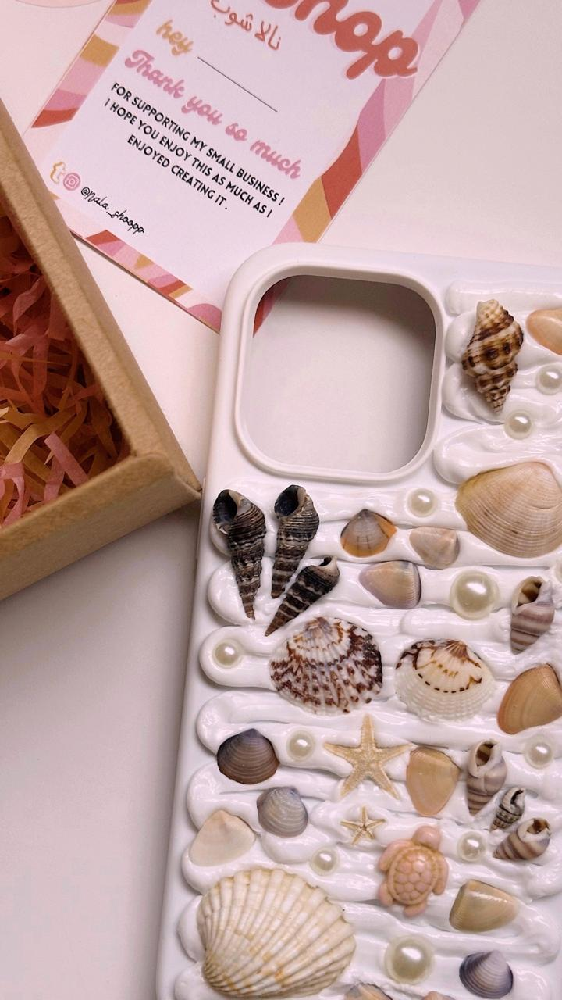

# Product Management & Customization Guide

This guide explains how to edit products, manage content, and customize your Nala Shop website.

## Table of Contents
1. [Product Management](#product-management)
2. [Color Customization](#color-customization)
3. [Image Management](#image-management)
4. [Content Editing](#content-editing)
5. [Adding New Products](#adding-new-products)
6. [Removing Products](#removing-products)

---

## Product Management

### Editing Product Information

Products are defined in the `index.html` file. Look for the product sections:

```html
<!-- Example Product Structure -->
<!-- Found in index.html at lines: 143, 150, 157, 692, 719, 746 -->
<div class="product-card">                                    
      
    <h3>Product Name</h3>                                      
    <p class="price">$19.99</p>                               
    <p class="description">Product description goes here</p>   
    <button class="btn-ocean">Add to Cart</button>             <!-- Found in index.html at lines: 61, 113, 823, 917, 943, 979, 1085 -->             
</div>                                                          
```

**To edit a product:**
1. Open `index.html` in a text editor
2. Find the product card you want to edit
3. Modify the following elements:
   - `src="images/product1.jpg"` - Change the image path
   - `alt="Product Name"` - Update the alt text for accessibility
   - `<h3>Product Name</h3>` - Change the product title
   - `<p class="price">$19.99</p>` - Update the price
   - `<p class="description">...</p>` - Edit the product description

---

## Color Customization

### Main Color Palette

Colors are defined in `css/styles.css` at the top of the file in the `:root` section:

```css
:root {                                                        /* Line 42 */
    /* New Pastel Theme Colors */
    --cream-base: #EFDFD5;     /* Main background color */     /* Line 44 */
    --soft-pink: #F6B3BB;      /* Secondary elements */        /* Line 45 */
    --rose-pink: #F599A9;      /* Accent color */              /* Line 46 */
    --coral-peach: #F48C81;    /* Buttons and highlights */    /* Line 47 */
    --warm-peach: #F8C18C;     /* Warm accents */              /* Line 48 */
}                                                              /* Line 49 */
```

**To change colors:**
1. Open `css/styles.css`
2. Find the `:root` section at the top
3. Replace the hex color codes with your desired colors
4. Save the file - changes will apply automatically

### Specific Element Colors

**Buttons:**
```css
/* Found in css/styles.css at lines: 631, 653, 662, 666, 671, 676 */
/* Found in index.html at lines: 61, 113, 823, 917, 943, 979, 1085 */
/* Found in js/script.js at lines: 383, 566, 632 */
.btn-ocean {                                                   /* Line 631 in styles.css */
    background: var(--gradient-ocean); /* Uses gradient */     
    color: white;                                              
    border: none;                                              
    padding: 12px 24px;                                       
    border-radius: 25px;                                      
}                                                              

.quantity-btn {                                                /* Line 653 in styles.css */
    background: var(--soft-pink);     /* Uses solid color */   
    border: 1px solid var(--rose-pink);                       
    padding: 8px 12px;                                        
    border-radius: 4px;                                       
}                                                              
```

**Product Cards:**
```css
/* Found in css/styles.css at lines: 421, 435, 445, 450, 454, 463 */
.product-card {                                                /* Line 421 in styles.css */
    background: rgba(239, 223, 213, 0.9); /* Semi-transparent cream */ 
    border: 1px solid rgba(246, 179, 187, 0.3); /* Soft pink border */ 
}                                                              
```

---

## Image Management

### Hero Slideshow Images

The main slideshow images are located in the `images/` folder and referenced in `index.html`:

```html
<!-- Hero Slideshow -->
<div class="slideshow-image active" data-index="0">           <!-- Line 82 -->
     <!-- Line 83 -->
</div>                                                          <!-- Line 84 -->
```

**To change slideshow images:**
1. Add your new images to the `images/` folder
2. Open `index.html`
3. Find the slideshow section (around line 120)
4. Update the `src` attributes to point to your new images
5. Update the `alt` text for accessibility

### Product Images

**To add/change product images:**
1. Place your product images in the `images/` folder
2. Use descriptive filenames (e.g., `product-necklace-gold.jpg`)
3. Update the `src` attribute in the product card
4. Recommended image size: 400x400px for best quality

---

## Content Editing

### Website Title and Branding

**Page Title:**
```html
<title>Nala Shop - Your Store Name</title>                    <!-- Line 104 -->
```

**Logo/Brand Name:**
```html
        <!-- Line 108 -->
```

### Navigation Menu

Edit navigation links in the header section:

```html
<nav class="hidden md:flex space-x-8">                         <!-- Line 114 -->
    <a href="#home" class="nav-link">Home</a>                  <!-- Line 115 -->
    <a href="#products" class="nav-link">Products</a>          <!-- Line 116 -->
    <a href="#about" class="nav-link">About</a>                <!-- Line 117 -->
    <a href="#contact" class="nav-link">Contact</a>            <!-- Line 118 -->
</nav>                                                          <!-- Line 119 -->
```

### Footer Information

```html
<footer>                                                       <!-- Line 123 -->
    <p>&copy; 2024 Nala Shop. All rights reserved.</p>        <!-- Line 124 -->
    <p>Contact: info@nalashop.com | Phone: (555) 123-4567</p> <!-- Line 125 -->
</footer>                                                      <!-- Line 126 -->
```

---

## Adding New Products

### Step-by-Step Process

1. **Prepare your product image:**
   - Resize to 400x400px
   - Save in `images/` folder with descriptive name

2. **Add product HTML:**
   ```html
   <div class="product-card">                                  <!-- Line 139 -->
        <!-- Line 140 -->
       <h3>New Product Name</h3>                              <!-- Line 141 -->
       <p class="price">$29.99</p>                           <!-- Line 142 -->
       <p class="description">Detailed product description here</p> <!-- Line 143 -->
       <div class="product-actions">                          <!-- Line 144 -->
           <button class="quantity-btn" onclick="decreaseQuantity(this)">-</button> <!-- Line 145 -->
           <span class="quantity">1</span>                   <!-- Line 146 -->
           <button class="quantity-btn" onclick="increaseQuantity(this)">+</button> <!-- Line 147 -->
           <button class="btn-ocean" onclick="addToCart(this)">Add to Cart</button> <!-- Found in index.html at lines: 61, 113, 823, 917, 943, 979, 1085 -->
       </div>                                                  <!-- Line 149 -->
   </div>                                                      <!-- Line 150 -->
   ```

3. **Add to product grid:**
   - Find the products section in `index.html`
   - Insert your new product card within the grid container

---

## Removing Products

### To remove a product:

1. **Find the product card** in `index.html`
2. **Delete the entire product card div:**
   ```html
   <!-- DELETE THIS ENTIRE BLOCK -->                          <!-- Line 163 -->
   <div class="product-card">                                <!-- Line 164 -->
       <!-- All content inside -->                            <!-- Line 165 -->
   </div>                                                      <!-- Line 166 -->
   <!-- END DELETE -->                                        <!-- Line 167 -->
   ```

3. **Remove the product image** from the `images/` folder (optional)

---

## Advanced Customizations

### Adding New Sections

**To add a new section:**
```html
<section class="section">                                     <!-- Line 178 -->
    <div class="wrapper">                                      <!-- Line 179 -->
        <h2>New Section Title</h2>                             <!-- Line 180 -->
        <p>Section content goes here</p>                       <!-- Line 181 -->
    </div>                                                      <!-- Line 182 -->
</section>                                                      <!-- Line 183 -->
```

### Custom Styling

**Add custom CSS at the end of `css/styles.css`:**
```css
/* Custom Styles */                                            /* Line 189 */
.my-custom-class {                                             /* Line 190 */
    background-color: var(--soft-pink);                       /* Line 191 */
    padding: 1rem;                                             /* Line 192 */
    border-radius: 0.5rem;                                     /* Line 193 */
}                                                              /* Line 194 */
```

### JavaScript Functionality

Product interactions are handled in `js/script.js`. Here's a detailed breakdown:

#### Core Shopping Functions

**Add to Cart Function:**
```javascript
/* Found in js/script.js - product-card references at lines: 542, 960 */
function addToCart(element) {                                  
    // Gets product information from the clicked element       
    const productCard = element.closest('.product-card');     // Line 960 in script.js
    const productName = productCard.querySelector('h3').textContent; 
    const productPrice = productCard.querySelector('.price').textContent; 
    const quantity = parseInt(productCard.querySelector('.quantity').textContent); 
    
    // Add to cart logic here                                 
    console.log(`Added ${quantity} x ${productName} to cart`); 
    updateCartDisplay();                                       
}                                                              
```

**Quantity Management:**
```javascript
function increaseQuantity(button) {                           // Line 217
    const quantitySpan = button.parentNode.querySelector('.quantity'); // Line 218
    let currentQuantity = parseInt(quantitySpan.textContent); // Line 219
    quantitySpan.textContent = currentQuantity + 1;           // Line 220
}                                                              // Line 221

function decreaseQuantity(button) {                           // Line 223
    const quantitySpan = button.parentNode.querySelector('.quantity'); // Line 224
    let currentQuantity = parseInt(quantitySpan.textContent); // Line 225
    if (currentQuantity > 1) {                                // Line 226
        quantitySpan.textContent = currentQuantity - 1;       // Line 227
    }                                                          // Line 228
}                                                              // Line 229
```

**Cart Display Update:**
```javascript
function updateCartDisplay() {                                // Line 233
    // Update cart counter in navigation                       // Line 234
    const cartCounter = document.querySelector('.cart-counter'); // Line 235
    if (cartCounter) {                                         // Line 236
        cartCounter.textContent = getTotalCartItems();        // Line 237
    }                                                          // Line 238
}                                                              // Line 239
```

#### Slideshow Functions

**Image Navigation:**
```javascript
let currentSlide = 0;                                         // Line 244
const slides = document.querySelectorAll('.slideshow-image'); // Line 245

function nextSlide() {                                        // Line 247
    slides[currentSlide].classList.remove('active');         // Line 248
    currentSlide = (currentSlide + 1) % slides.length;       // Line 249
    slides[currentSlide].classList.add('active');            // Line 250
    updateIndicators();                                       // Line 251
}                                                              // Line 252

function prevSlide() {                                        // Line 254
    slides[currentSlide].classList.remove('active');         // Line 255
    currentSlide = currentSlide === 0 ? slides.length - 1 : currentSlide - 1; // Line 256
    slides[currentSlide].classList.add('active');            // Line 257
    updateIndicators();                                       // Line 258
}                                                              // Line 259
```

**Auto-play Slideshow:**
```javascript
function startSlideshow() {                                   // Line 263
    setInterval(nextSlide, 5000); // Change slide every 5 seconds // Line 264
}                                                              // Line 265

// Start slideshow when page loads                            // Line 267
document.addEventListener('DOMContentLoaded', startSlideshow); // Line 268
```

#### How to Edit JavaScript

**1. Adding New Product Functions:**
```javascript
// Add this function to js/script.js                         // Line 274
function addToWishlist(element) {                             // Line 275
    const productCard = element.closest('.product-card');    // Line 276
    const productName = productCard.querySelector('h3').textContent; // Line 277
    
    // Your wishlist logic here                              // Line 279
    console.log(`Added ${productName} to wishlist`);         // Line 280
    
    // Visual feedback                                       // Line 282
    element.innerHTML = '❤️ Added to Wishlist';              // Line 283
    element.disabled = true;                                  // Line 284
}                                                              // Line 285
```

**2. Then add the button to your HTML:**
```html
<button class="btn-secondary" onclick="addToWishlist(this)">Add to Wishlist</button> <!-- Line 289 -->
```

**3. Modifying Existing Functions:**

To change the slideshow speed:
```javascript
// Find this line in script.js:                             // Line 295
setInterval(nextSlide, 5000); // 5000 = 5 seconds           // Line 296

// Change to:                                                // Line 298
setInterval(nextSlide, 3000); // 3000 = 3 seconds           // Line 299
```

To change quantity limits:
```javascript
// In decreaseQuantity function, change minimum:             // Line 303
if (currentQuantity > 1) { // Change 1 to your minimum      // Line 304

// In increaseQuantity function, add maximum:                // Line 306
function increaseQuantity(button) {                          // Line 307
    const quantitySpan = button.parentNode.querySelector('.quantity'); // Line 308
    let currentQuantity = parseInt(quantitySpan.textContent); // Line 309
    if (currentQuantity < 10) { // Add maximum limit         // Line 310
        quantitySpan.textContent = currentQuantity + 1;      // Line 311
    }                                                         // Line 312
}                                                             // Line 313
```

#### Adding New Interactive Features

**Product Search Function:**
```javascript
function searchProducts() {                                   // Line 319
    const searchInput = document.querySelector('#search-input'); // Line 320
    const searchTerm = searchInput.value.toLowerCase();       // Line 321
    const productCards = document.querySelectorAll('.product-card'); // Line 322
    
    productCards.forEach(card => {                           // Line 324
        const productName = card.querySelector('h3').textContent.toLowerCase(); // Line 325
        const productDesc = card.querySelector('.description').textContent.toLowerCase(); // Line 326
        
        if (productName.includes(searchTerm) || productDesc.includes(searchTerm)) { // Line 328
            card.style.display = 'block';                    // Line 329
        } else {                                              // Line 330
            card.style.display = 'none';                     // Line 331
        }                                                     // Line 332
    });                                                       // Line 333
}                                                             // Line 334
```

**Product Filtering:**
```javascript
function filterByPrice(maxPrice) {                            // Line 338
    const productCards = document.querySelectorAll('.product-card'); // Line 339
    
    productCards.forEach(card => {                           // Line 341
        const priceText = card.querySelector('.price').textContent; // Line 342
        const price = parseFloat(priceText.replace('$', ''));  // Line 343
        
        if (price <= maxPrice) {                             // Line 345
            card.style.display = 'block';                    // Line 346
        } else {                                              // Line 347
            card.style.display = 'none';                     // Line 348
        }                                                     // Line 349
    });                                                       // Line 350
}                                                             // Line 351
```

#### Removing JavaScript Features

**To remove a function:**
1. Delete the function from `js/script.js`
2. Remove any HTML elements that call it
3. Remove any event listeners that reference it

**Example - Removing slideshow auto-play:**
```javascript
// Find and delete or comment out:                           // Line 361
// setInterval(nextSlide, 5000);                             // Line 362
// startSlideshow();                                         // Line 363
```

#### Event Listeners

**Adding click events:**
```javascript
document.addEventListener('DOMContentLoaded', function() {    // Line 369
    // Add event listener to all product cards               // Line 370
    const productCards = document.querySelectorAll('.product-card'); // Line 371
    productCards.forEach(card => {                           // Line 372
        card.addEventListener('click', function() {           // Line 373
            // Your click handler here                       // Line 374
            console.log('Product card clicked!');            // Line 375
        });                                                   // Line 376
    });                                                       // Line 377
});                                                           // Line 378
```

**Form handling:**
```javascript
function handleContactForm(event) {                          // Line 382
    event.preventDefault(); // Prevent form submission      // Line 383
    
    const formData = new FormData(event.target);             // Line 385
    const name = formData.get('name');                       // Line 386
    const email = formData.get('email');                     // Line 387
    const message = formData.get('message');                 // Line 388
    
    // Process form data                                     // Line 390
    console.log('Form submitted:', { name, email, message }); // Line 391
}                                                             // Line 392
```

#### Local Storage for Cart

**Save cart data:**
```javascript
function saveCartToStorage(cartItems) {                      // Line 398
    localStorage.setItem('nalashop-cart', JSON.stringify(cartItems)); // Line 399
}                                                             // Line 400

function loadCartFromStorage() {                             // Line 402
    const saved = localStorage.getItem('nalashop-cart');     // Line 403
    return saved ? JSON.parse(saved) : [];                   // Line 404
}                                                             // Line 405
```

#### Animation Functions

**Smooth scrolling:**
```javascript
function smoothScrollTo(elementId) {                         // Line 411
    const element = document.getElementById(elementId);      // Line 412
    element.scrollIntoView({                                 // Line 413
        behavior: 'smooth',                                  // Line 414
        block: 'start'                                       // Line 415
    });                                                      // Line 416
}                                                            // Line 417
```

**Fade in animations:**
```javascript
function fadeInOnScroll() {                                  // Line 421
    const elements = document.querySelectorAll('.fade-in');  // Line 422
    
    elements.forEach(element => {                            // Line 424
        const elementTop = element.getBoundingClientRect().top; // Line 425
        const elementVisible = 150;                          // Line 426
        
        if (elementTop < window.innerHeight - elementVisible) { // Line 428
            element.classList.add('active');                // Line 429
        }                                                    // Line 430
    });                                                      // Line 431
}                                                            // Line 432

window.addEventListener('scroll', fadeInOnScroll);           // Line 434
```

---

## Best Practices

### Image Optimization
- Use WebP format for better compression
- Optimize images before uploading (use tools like TinyPNG)
- Keep file sizes under 500KB for fast loading

### SEO Considerations
- Always include descriptive `alt` text for images
- Use semantic HTML structure
- Update meta descriptions for better search rankings

### Accessibility
- Maintain good color contrast ratios
- Use proper heading hierarchy (h1, h2, h3)
- Ensure all interactive elements are keyboard accessible

---

## Troubleshooting

### Common Issues

**Images not loading:**
- Check file path is correct
- Ensure image file exists in `images/` folder
- Verify file extension matches (jpg, jpeg, png, webp)

**Colors not updating:**
- Clear browser cache (Ctrl+F5)
- Check CSS syntax for typos
- Ensure color values are valid hex codes

**Layout broken:**
- Validate HTML structure
- Check for missing closing tags
- Ensure CSS classes are spelled correctly

---

## File Structure Reference

```
Nala Shop/
├── index.html              # Main website file
├── css/
│   └── styles.css          # All styling and colors
├── js/
│   └── script.js           # Interactive functionality
├── images/
│   ├── 1.jpeg - 38.jpeg    # Slideshow images
│   ├── logo.png            # Website logo
│   └── product-*.jpg       # Product images
└── PRODUCT_MANAGEMENT_GUIDE.md # This guide
```

### Key Component Line Numbers

**Header & Navigation:**
- `index.html` lines 30-80: Header structure
- `css/styles.css` lines 91, 106: Mobile header styles
- `css/styles.css` lines 190-245: Desktop header styles

**Product Cards:**
- `index.html` lines 143, 150, 157, 692, 719, 746: Product card elements
- `css/styles.css` lines 421-463: Product card styling
- `js/script.js` lines 542, 960: Product card JavaScript references

**Buttons:**
- `index.html` lines 61, 113, 823, 917, 943, 979, 1085: Button elements
- `css/styles.css` lines 631-676: Button styling
- `js/script.js` lines 383, 566, 632: Button JavaScript

**Navigation Functions:**
- `js/script.js` lines 896, 1548, 1596, 1692: Navigation JavaScript

---

## Need Help?

If you encounter issues:
1. Check the browser console for error messages (F12)
2. Validate your HTML and CSS syntax
3. Test changes in a local environment first
4. Keep backups of working versions

**Remember:** Always test your changes in a browser before publishing to ensure everything works correctly!